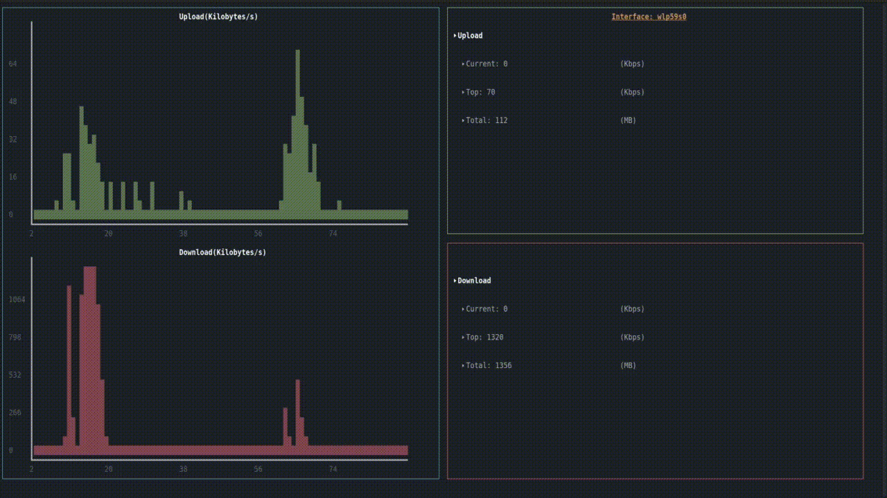

# BandMonitor

**BandMonitor** is a simple network bandwidth monitoring script written entirely in Bash.  
It's not intended for serious or long-term use — more of a fun or educational tool.

---

## 📦 Installation

### Clone the repository

To get started, clone the repository and navigate into the project directory:

```bash
git clone <repo_url>
cd BandMonitor
```

---

## 🚀 Usage

First, make the script executable:

```bash
chmod u+x bandwidth.sh
```

Then run the script with the following syntax:

```bash
./bandwidth.sh <interface_name> <period>
```

- `<interface_name>`: The name of the network interface you want to monitor.  
  You can list your network interfaces using:

  ```bash
  ifconfig
  ```

- `<period>`: The interval in **seconds** between updates (must be an integer).

---

## 📘 Example

To monitor interface `wlp59s0` with a 2-second update interval:

```bash
./bandwidth.sh wlp59s0 2
```



---

## 🧾 License

This project is licensed under the terms of the MIT License.
